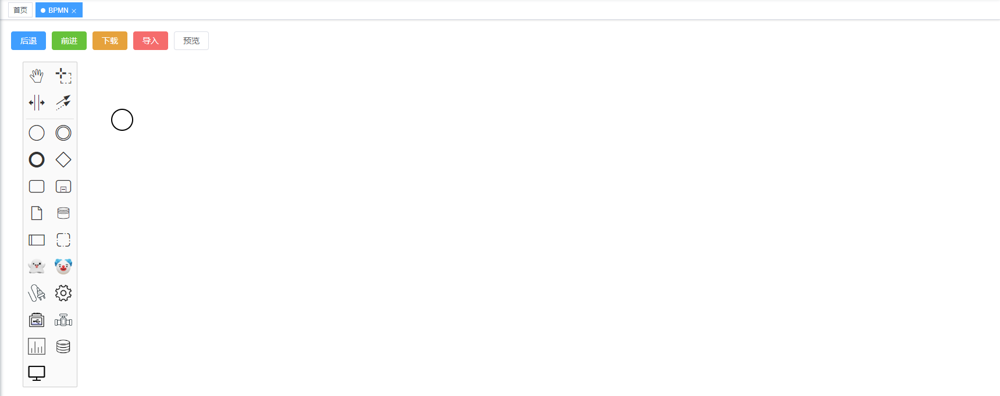
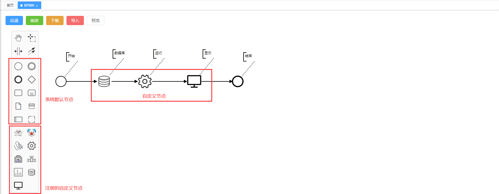

# BPMN 工作流组件

满足绘制，导出，导出工作流，同时可以自定义节点

有待完成：点击节点跳转对应的业务

# 目录结构
`BpmnBoard` 绘制工作流
`BpmnBoard/customPalette` 自定义节点
`BpmnPreview` 工作流预览

# 使用方法
在项目中安装Bpmn
```sh
npm install bpmn-js
``` 

在`main.js`中增加样式
```js
// bpmn绘图工具的样式
import 'bpmn-js/dist/assets/diagram-js.css'
import 'bpmn-js/dist/assets/bpmn-font/css/bpmn.css'
import 'bpmn-js/dist/assets/bpmn-font/css/bpmn-codes.css'
import 'bpmn-js/dist/assets/bpmn-font/css/bpmn-embedded.css'

// 引入Bpmn 自定义节点样式
import '@/components/BpmnBoard/customPalette/customPalette.scss'
```

在目标页面中引入该工作流组件
```vue
<template>
  <div>
    <BpmnBoard />
  </div>
</template>
<script>
import BpmnBoard from "@/components/BpmnBoard/index.vue";
export default {
  components: {
    BpmnBoard
  },
  data(){
    return {};
  },
  methods: {
  }
}
</script>
```

# 注意
`CustomPalette.js` 是用于在左侧工具栏注册自定义节点

`CustomRenderer.js` 是用于自定义节点的绘制

# 效果
加载完成


绘制工作流
